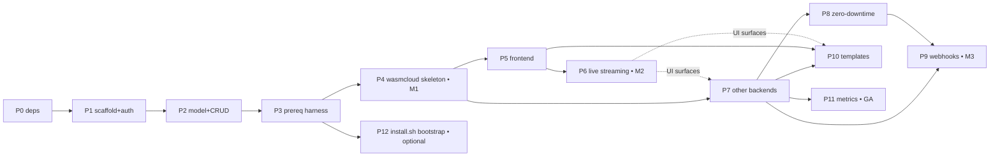

# postlab go — Implementation Roadmap

Execution sequence for the design in [`postlab_go.md`](./postlab_go.md). That document is
the source of truth for *what* `postlab go` is; this one is the source of truth for *in what
order it gets built and how each step is proven done*. When the two disagree on behavior, the
design doc wins; when they disagree on sequencing, this doc wins.

Companion analysis: [`../research/postlab_go_edge_cases.md`](../research/postlab_go_edge_cases.md),
[`../research/postlab_go_alternatives.md`](../research/postlab_go_alternatives.md),
[`../research/postlab_go_diagrams.md`](../research/postlab_go_diagrams.md),
[`../research/postlab_go_tooling_problems.md`](../research/postlab_go_tooling_problems.md).

> **WASM is the first-class deployment target.** The walking skeleton (Phase 4 / M1) deploys a
> **wasmcloud** app end-to-end. Every other runtime — docker-compose, systemd, pm2, k3s, static
> — is a later phase (Phase 7). This matches where the repo already invests: `wasm_cloud/cli.rs`
> (`find_wash` + install), a full NATS lifecycle in `nats/mod.rs`, and `runner.rs`'s existing
> `wash app deploy` path give wasmcloud more real scaffolding than any other backend today.

> **Tooling is a hard dependency, not a footnote.** `postlab go` shells out to git, `wash`, a
> running wasmcloud host, nats-server (and later docker, caddy, node/pm2, k3s/kubectl, language
> build toolchains) — **none guaranteed on a fresh Linux install**. The tooling-problems doc
> shows the deploy path fails on a bare box without its tools present. That is why a
> **prerequisite harness (Phase 3) lands before the walking skeleton (Phase 4)**, and why
> per-backend prereq enforcement is woven into the backends phase rather than deferred.

## How to read this

- The original plan's six phases are expanded into **11 phases** with lettered sub-phases.
  A sub-phase is the smallest unit that lands on its own with `make check && make test` green.
- Each phase lists **Depends on**, **Work**, **Exit gate**, and **Risks**. A phase is not
  "done" until its exit gate is met — not when the code merely compiles.
- Phases are ordered so the system is **end-to-end demonstrable as early as possible**
  (walking skeleton at M1), not so that whole layers land at once.

### Shippable milestones

| Milestone | Reached after | What works |
|---|---|---|
| **M1 — Headless WASM deploy** | Phase 4 | `postlab go` serves an authed API, **detects and (with consent) installs `wash` + nats + a wasmcloud host on a bare box**, then deploys a **wasmcloud** app end-to-end (git → `wash app deploy` → readiness → Caddy) with no browser. |
| **M2 — Usable web UI** | Phase 6 | Dashboard, new-app wizard, env editor, deploy history, a **"missing tools" banner with one-click install**, and **live** streaming deploy/logs in the browser. |
| **M3 — Multi-runtime + push-to-deploy** | Phase 9 | docker-compose/systemd/static/pm2/k3s backends (each enforcing its own prerequisites), zero-downtime swaps, and GitHub/GitLab webhooks. |
| **GA — 1.0** | Phase 11 | Template catalog and Prometheus metrics/sparklines. |
| Post-1.0 | Phase 12+ | `install.sh --bootstrap`, Tailscale Funnel, WASM plugins, daemon mode. |

### Non-collapsible gates (from CLAUDE.md, apply throughout)

- **QAS** — every sub-phase ends with `make check` (zero warnings) **and** `make test` green.
- **Schema confirmation** — the `apps`/`app_env_vars`/`app_deploys` tables ship as inline
  `CREATE TABLE IF NOT EXISTS` in `db/mod.rs` (Phase 2), **not** files under `migrations/`.
  No `.sql` file is created without user confirmation.
- **Security review** — every system-mutating diff (git, docker, systemd, Caddy, webhook
  receiver, auth) gets a cold-agent security review before merge.
- **Manual web verification** — the web UI can't be verified headlessly, the same way TUI
  screens can't. Any phase touching `web/` ends with an explicit "needs `sudo postlab go` +
  browser check" note; do not claim a UI works without it.
- **CI / `install.sh` confirmation** — `make build-release` frontend integration (Phase 5f)
  and any CD matrix change require user confirmation before touching `.github/workflows/` or
  `install.sh`.
- **`feature_list.json`** — updated whenever a screen, tab, or CLI command is added/renamed
  (Phases 1, 4, and each new page).

---

## Phase 0 — Dependency & repo prep

The cheapest way to de-risk Phase 1: get every dependency and build-gate concern out of the
way first, in one small, reviewable diff that changes no behavior.

**Depends on:** nothing.

**Work**
- [ ] Add to `cli/Cargo.toml` (consume the workspace pins): `axum`, `tower`, `tower-http`,
      `rust-embed`, `dashmap`.
- [ ] `rust-embed`: add the **`debug-embed`** feature (workspace currently pins only
      `compression`) so dev/`check` builds read `web/dist/` from disk and don't require npm.
- [ ] **`dashmap` and `arraydeque` are not in the workspace `Cargo.toml` yet** — add the pins
      there first, then consume. (The design doc's Phase 1 wording assumes they're already
      pinned like axum/tower; they are not.)
- [ ] Add the **`v7`** feature to the workspace `uuid` pin (currently `features = ["v4"]`)
      for `app_deploys.id`.
- [ ] Commit a placeholder `web/dist/index.html` ("run `npm run build`") so `rust-embed`'s
      compile-time `#[folder]` resolution succeeds on a fresh checkout.
- [ ] Fix the two known inconsistencies in `postlab_go.md`: deploy-workflow step 2 references
      `app.deploy_type` (that column is gone — it's now `app.runtime`); and confirm the
      frontend section reads "SvelteKit + adapter-static" throughout.

This phase also satisfies the **frontend-build-safety** items from the tooling doc (its
"Phase C"): the committed `web/dist/` placeholder + `debug-embed` are exactly what keep
`make check`/`make build` working on a clone with no node installed.

**Exit gate**
- `make check && make test` green with the new deps present but unused (allow `dead_code`
  where needed, removed as each is consumed).
- Fresh `git clone` + `make build` succeeds **without** running any npm command.

**Risks**
- `debug-embed` + `compression` feature interaction — verify a release build still embeds and
  compresses real assets (re-checked at Phase 5f).

---

## Phase 1 — Server scaffold + auth

Stand up the `postlab go` process: it binds, authenticates, serves the embedded SPA shell,
and exits cleanly. No app logic yet.

**Depends on:** Phase 0.

### 1a — CLI + lifecycle
- [ ] `postlab go` subcommand in `main.rs` with `--port` / `--metrics-port` / `--bind` /
      `--webhook` / `--webhook-port` / `--api-key-file`. (Root check stays — do not weaken.)
- [ ] `AppState { db, platform, app_manager, ws_registry }` skeleton (managers stubbed).
- [ ] Port-bind with **reserved-port-skipping** fallback (API 9020→9023+, webhook 9021→9031+,
      metrics 9022→9041+; never stomp the other two defaults). Explicit `--port` in use →
      hard error, never silent move.
- [ ] Graceful shutdown on SIGINT/SIGTERM (close WS, drain ≤5s, flush WAL, exit 0).
- [ ] Update `feature_list.json` with the `go` command.

### 1b — Auth middleware (day one, not deferred)
- [ ] Bearer token: generated on first run, printed **once** to stdout, stored **hashed** in
      DB. Hash scheme is deterministic — `SHA-256(token)` (edge-case 1.1) — *not* a password
      hash, since the raw token is discarded.
- [ ] Token source precedence: `POSTLAB_API_KEY` env / `--api-key-file` > persisted hash.
      Trim trailing whitespace/newlines from the file (edge-case 2).
- [ ] Origin/Host allow-list middleware (loopback + configured bind). Decide `Origin: null`
      handling explicitly (reject by default).
- [ ] `postlab go --rotate-token` (or equivalent) so a lost token doesn't require DB surgery.

### 1c — Asset serving + transport skeleton
- [ ] `rust-embed` `WebAssets` from `web/dist/`; serve embedded bytes via axum.
- [ ] SPA fallback: all `/ui/*` → `index.html`; API under `/api/v1`.
- [ ] `GET /healthz` (unauthed liveness) + authed `GET /api/v1/ping`.
- [ ] WS endpoint placeholder at `/ws` (upgrade handshake only; no events yet).

**Exit gate**
- `curl http://127.0.0.1:9020/api/v1/ping` → 401 without token, 200 with token.
- Cross-origin / bad-Host request → 403.
- Ctrl+C shuts down within the drain window, exit 0.
- `make check && make test` green.

**Risks**
- Auth middleware ordering (Origin check must run *before* token lookup to avoid a DB hit on
  rebinding attempts).

---

## Phase 2 — Data model + app CRUD + concurrency primitives

**Depends on:** Phase 1.

### 2a — Schema
- [ ] `apps`, `app_env_vars`, `app_deploys` as inline `CREATE TABLE IF NOT EXISTS` in
      `db/mod.rs` (or a `db/apps.rs` helper it calls). **Confirm with user** before touching
      `migrations/` — these do **not** go there.
- [ ] Add a comment in `db/mod.rs` noting `migrations/` are not applied at runtime and inline
      schema must be kept in sync (alternatives doc §2 recommendation).
- [ ] Validate `app.id` / `app_id` as `^[a-z0-9_-]+$` at creation (edge-case 1.10 — load-bearing
      for systemd unit names later).

### 2b — CRUD module + REST
- [ ] `core/apps/` module: create / get / list / delete (cascade) — pure DB, no deploy yet.
- [ ] REST: `GET|POST /api/v1/apps`, `GET|DELETE /api/v1/apps/:id`.
- [ ] Env endpoints: `GET|PUT /api/v1/apps/:id/env`, `DELETE …/env/:key` (mask `secret=1`).
- [ ] Per-app `webhook_secret` generated at create time; surfaced once on read.

### 2c — Concurrency primitives
- [ ] `AppManager` holds `DashMap<app_id, Mutex<()>>` deploy locks (edge-case 1.5); acquire
      before any deploy/rollback/start/stop. Wire the guard now even though deploy lands in P3.

**Exit gate**
- Integration test: create → list → get → put env → delete (cascade verified) over HTTP.
- `make check && make test` green.

**Risks**
- Cascade delete must also remove on-disk `config_dir` and deploy logs, not just rows.

---

## Phase 3 — Prerequisite harness (tooling bootstrap)

The walking skeleton can't run on a fresh box until the system can **detect and install the
tools it shells out to**. This phase builds that harness once, so every later phase declares
its tools instead of failing at a bare `Command::new(...)`. Source: tooling-problems doc
§"Resolution strategies" 1/2/5 (its Phases A + E).

**Depends on:** Phase 2.

### 3a — Detection + ensure layer
- [ ] New `core/tooling/` module: `ToolRequirement { name, bin, min_version, install_cmd,
      optional }`, plus `check()` (PATH + version via existing `packages::which()`), `ensure()`
      (install if missing), `health()` (post-install reachability).
- [ ] Version parsing where it matters (docker ≥ 24, caddy ≥ 2); skip where it doesn't.

### 3b — Installation backend
- [ ] Add `PackageManager::install_many(&[&str])` to `AptManager`/`DnfManager`/`PacmanManager`/
      `BrewManager` (today only `install`/`install_streamed` exist). Reuse the existing
      `install_streamed` mpsc progress channel.
- [ ] **M1-critical toolset first**: git, `wash` (reuse `wasm_cloud/cli.rs` install logic),
      nats-server (reuse `nats/mod.rs` auto-download), and the wasmcloud host. The
      docker/compose/podman/caddy/node maps land here too but only gate later backends.
- [ ] `ScriptInstaller` + static-binary fallback (extend the existing `nats/mod.rs` curl-download
      pattern) for tools not in distro repos — `wash`, caddy static binary, kubectl.
- [ ] **Caddy repo/GPG-key setup** on Debian (the existing `CaddyManager::install` skips it and
      fails on fresh systems) — and document the third-party-repo trust decision with an opt-out.

### 3c — Doctor + diagnostics endpoint
- [ ] `postlab go --doctor` CLI: prints per-tool installed/version/installable status.
- [ ] `GET /api/v1/health/tools` returning the same as JSON (consumed by the UI banner in P5).
- [ ] Graceful-degradation matrix (tooling doc §4): no package manager → exit with clear message
      (TUI already bails this way); missing required tool for a chosen backend → actionable error,
      never silent degradation.

**Exit gate**
- On a fresh VM with no `wash`/nats/host, `postlab go --doctor` reports them missing +
  installable; `ensure()` installs them; `health()` confirms a reachable wasmcloud host
  (`wash` can talk to it) afterward. The docker/caddy paths are exercised by a unit test even
  though they don't gate M1.
- `make check && make test` green. Security review (this code adds third-party repos and runs
  privileged installs, including the wasmCloud `curl | bash` script path).

**Risks**
- **`curl | bash` install for `wash`** (existing `wasm_cloud/cli.rs` path) — pin/verify where
  possible; document the trust decision alongside the Caddy-repo one.
- **Root vs. user installs** for node/pm2 (open question 1) — decide system-wide vs. invoking
  user's home now, since 3b's node mapping sets the precedent.
- Lazy install of large build toolchains (Rust/TinyGo for `wash build`, plus gcc/go/cargo/python
  for later backends) is deferred to the phases that need them, not done here.

---

## Phase 4 — Walking skeleton: git + **wasmcloud** + deploy pipeline (**M1**)

The keystone phase. One backend, end-to-end, no browser. **wasmcloud is first-class** and the
backend the walking skeleton proves: it has the most existing scaffolding in the repo
(`wasm_cloud/cli.rs`, `nats/mod.rs`, `runner.rs`'s `wash app deploy`), and the simplest path
(a `wadm.yaml` referencing pre-built OCI components) sidesteps any local build, the same way a
compose image would. The conventional runtimes are deliberately deferred to Phase 7.

**Depends on:** Phase 3 (its deploy path calls `ensure()` for git + `wash` + nats + a running
wasmcloud host — and caddy if `app.domain` is set — before doing anything; this is what makes
M1 work on a bare box).

### 4a — Net-new `--ff-only` git layer
- [ ] Replace the bare-`git pull` stub (`core/deploy/git.rs`): `git clone` when absent, else
      `git pull --ff-only`. Run `git status --porcelain` first; refuse dirty trees with a
      clear error (edge-case 3). Provide a force-redeploy path that discards local changes.

### 4b — RuntimeBackend trait + dispatch
- [ ] Define the trait per design doc, including **`supports_http_health()`** opt-out (wasmcloud
      readiness is a wadm/host status, not necessarily an HTTP GET — see 4e).
- [ ] `AppManager` dispatch on `app.runtime` (single backend registered for now).

### 4c — wasmcloud backend
- [ ] Ensure a wasmcloud host + NATS are running (reuse `nats/mod.rs` `start_async` /
      `init_wasmcloud_buckets_async`; `wash up` for the host). Treat host lifecycle as part of
      the backend, not the per-app deploy.
- [ ] Generate/validate `wadm.yaml` if the repo lacks one; deploy via `wash app deploy` (the
      existing `runner.rs` path). The simple M1 path uses a wadm manifest pointing at published
      OCI components — `wash build` from source is a later concern (toolchain-gated, like the
      systemd build story in 7b).
- [ ] **Fill the teardown stub**: `runner.rs` currently bails on WasmCloud stop ("needs app name
      parsing") — parse the app name from `wadm.yaml` and `wash app delete` / `undeploy`.
- [ ] status/logs via `wash app get` / host logs.

### 4d — Deploy workflow engine
- [ ] **Prereq gate (first step):** call Phase 3 `ensure()` for git + `wash` + nats + host
      (+ caddy if `app.domain`) before touching the repo; abort with the doctor-style error if a
      required tool is missing and can't be installed.
- [ ] `AppManager::deploy`: ensure → git → detect (wasmcloud only for now) → generate `wadm.yaml`
      → `wash app deploy` → readiness → gateway → complete. Writes `app_deploys` rows and a log
      file at `~/postlab/apps/<id>/deploys/<deploy_id>.log`.
- [ ] `POST /api/v1/apps/:id/deploy`, `…/stop`, `…/start`.

### 4e — Readiness / health checker
- [ ] wasmcloud readiness comes from **wadm/host status** (`wash app get` → scaled & healthy),
      not a blind HTTP poll, since not every component exposes an HTTP server. If the app uses
      the httpserver capability on a port, additionally poll `GET :port{health_path}` every
      500ms with a **configurable** timeout (default 30s, edge-case 3). On failure: mark deploy
      failed, leave the prior app version deployed.

### 4f — Gateway integration
- [ ] When `app.domain` is set **and** the component exposes an httpserver port, call existing
      `CaddyManager::add_route` → `localhost:{port}`; reload. (CaddyManager is real today — wire,
      don't build.) Caddy presence is guaranteed by the 4d prereq gate. Components with no HTTP
      surface skip the gateway step.

**Exit gate (M1)**
- On a fresh VM, from a clean DB: `POST /apps` then `POST /apps/:id/deploy` against a real
  wasmcloud repo (wadm manifest referencing OCI components) brings the app to `running`
  (wadm reports it scaled/healthy), an httpserver component is reachable through Caddy, and a
  deploy log is on disk. `…/stop` tears it down cleanly (no more "not implemented" bail).
  Demonstrated headless (curl only).
- `make check && make test` green. Security review of the deploy/git/wash/gateway diff.

**Risks**
- Build output streaming isn't here yet (lands P6); deploy is synchronous/log-file-only for now.
- Caddy auto-TLS needs a real domain — document a localhost/`:port` smoke path for CI.
- wasmcloud host lifecycle: deciding host ownership (postlab-managed vs. pre-existing) and
  cleanup on `postlab go` shutdown. Per the design doc, running apps keep running — so the host
  is **not** torn down on shutdown.

---

## Phase 5 — Frontend MVP (**toward M2**)

**Depends on:** Phase 4 (a real API to talk to), Phase 3 (`/api/v1/health/tools` for the banner).

### 5a — Scaffold
- [ ] `web/` SvelteKit project, `adapter-static` SPA (`fallback: index.html`, prerender off).
- [ ] `lib/api.ts` (typed fetch wrappers), `lib/ws.ts` (client w/ reconnect, stubbed until P6),
      `lib/stores.ts`.

### 5b — Login + token handling
- [ ] Login screen: token entered, held **in memory only** (document re-entry on reload).

### 5c–5e — Pages
- [ ] Dashboard: app list + system overview gauges (from Platform).
- [ ] **"Missing tools" banner** reading `GET /api/v1/health/tools`, with one-click install
      buttons (tooling doc "Phase E" UI half).
- [ ] New-app wizard (runtime → source → domain → env → review). Surface per-backend prereq
      status here once Phase 7 lands `prerequisites()`.
- [ ] App detail overview (status, domain, latest deploy), env editor (masking), deploy history.
- [ ] Update `feature_list.json` with each web page.

### 5f — Build integration
- [ ] `make build-release` runs `npm ci && npm run build` → `web/dist/`, then cargo. `make
      build`/`make check` stay npm-free (debug-embed). **Confirm before editing CI** if the CD
      matrix needs the node toolchain.

**Exit gate**
- `sudo postlab go` + browser: create an app via the wizard and watch it deploy (poll-based
  until P6). **Manual verification required — cannot be headless.**
- `make check && make test` green.

**Risks**
- SPA base-path / API-URL handling under the embedded server (alternatives §4 caveat).
- Release embed path (5f) is the first time real assets compile in — re-verify Phase 0's
  debug-embed/compression interaction.

---

## Phase 6 — Live streaming (**M2**)

**Depends on:** Phase 5.

- [ ] `WsRegistry` (`DashMap<app_id, Vec<Sender>>`); real `/ws` event broadcast.
- [ ] Deploy workflow emits `deploy.progress` line-by-line. **Split on `\r` as well as `\n`**
      so `npm ci`-style carriage-return progress streams correctly (edge-case 3).
- [ ] Streaming deploy log in wizard + detail page.
- [ ] `app.status` events; live per-app log viewer (`docker compose logs -f` equivalent).

**Exit gate (M2)**
- Browser shows a deploy streaming in real time and live app logs. Manual verification.
- `make check && make test` green.

**Risks**
- Backpressure / slow consumers on the WS registry; cap buffered lines per client.

---

## Phase 7 — Conventional runtime backends

Everything that isn't wasmcloud. Each sub-phase is independently shippable and ends by deploying
a representative repo. Ordered easiest-first. wasmcloud already shipped in Phase 4.

**Depends on:** Phase 4 (trait + dispatch, wasmcloud reference impl), Phase 3 (prereq harness).

- [ ] **7.0 — per-backend prereqs**: add `RuntimeBackend::prerequisites(&self) ->
      Vec<ToolRequirement>` and have `AppManager::deploy` call `ensure_all()` for the selected
      backend before git/build/start (tooling doc "Phase B"). wasmcloud's prereqs (defined in
      Phase 4) move under this interface too. Each backend below declares its own.
- [ ] **7a — static**: Caddy config → repo dir, no process, `supports_http_health() = false`;
      UI must not show a failing health badge (edge-case 4). *Prereqs:* caddy (if domain).
- [ ] **7b — docker-compose**: generate `docker-compose.yml` (+ minimal `Dockerfile` when the
      repo lacks one) with port mapping and env file; start/stop/status/logs via `docker compose …`.
      *Prereqs:* docker + `docker-compose-plugin` (or podman). The image carries the build, so no
      language toolchain needed.
- [ ] **7c — systemd**: generate `.service`, install to `/etc/systemd/system/<app_id>.service`,
      `systemctl` start/stop, `journalctl` logs. **Resolve the build story** for go/rust
      (where/whether the binary compiles, toolchain-present check) — the most underspecified
      part of the design. Relies on Phase 2a `app_id` validation. *Prereqs:* systemd present +
      **lazy** language toolchain install (gcc/make/go/cargo/python) only when the detector
      finds that language (tooling doc open-question 5).
- [ ] **7d — detector rewrite**: wasmcloud (already) + Node / Python / Go / Rust / compose /
      static (replaces the 2-case stub). **wasmcloud markers (`wadm.yaml`/`wasmcloud.toml`) take
      precedence** so the first-class path wins; define precedence for the rest when multiple
      markers match (edge-case 3).
- [ ] **7e — pm2**: `ecosystem.config.js`; *prereqs:* node/npm then `npm i -g pm2`, installed
      only with **explicit consent**, honoring the root-vs-user decision from Phase 3 (root-install
      caveat, edge-case 4).
- [ ] **7f — k3s**: generate deployment/service/ingress, `kubectl apply`; *prereqs:* k3s +
      kubectl via the harness's script/static-binary fallback, **explicit confirmation** for the
      invasive k3s install (opens ports, installs a unit — open-question 3); **fail gracefully**
      if a cluster is absent (edge-case 4).

**Exit gate (per sub-phase)**
- On a fresh VM, the backend's `prerequisites()` install cleanly (or fail with an actionable
  message), then a representative repo deploys, runs, logs, and tears down.
- Security review for docker/systemd/pm2/k3s diffs (they write privileged units/manifests and add repos).
- `make check && make test` green.

---

## Phase 8 — Zero-downtime deploys

**Depends on:** Phase 7 (docker-compose from 7b; k3s from 7f).

- [ ] Temp-port + Caddy route-swap for **docker-compose and k3s only** (systemd/pm2 = restart,
      static = git pull, per alternatives §8). wasmcloud gets rolling updates natively via wadm
      scaling, so it's outside this temp-port mechanism.
- [ ] **Probe temp-port bind availability** before selecting it (edge-case 1.8).
- [ ] **Orphan cleanup**: if health passes but gateway update fails, stop the new
      container/pod and keep the old route (edge-case 1.9).
- [ ] Rollback flow: checkout previous successful commit, re-run from build step (not git-revert).

**Exit gate**
- A redeploy swaps with no dropped requests against a continuously-curled endpoint; an induced
  gateway failure leaves no orphan container and the old version still serving.
- `make check && make test` green. Security review.

---

## Phase 9 — Webhooks / push-to-deploy (**M3**)

Intentionally **after** backends and zero-downtime: a webhook is only meaningful once a real
deploy across runtimes works, and it exposes a root-privileged trigger to the internet, so it
gets the most scrutiny.

**Depends on:** Phase 7, Phase 8 (rollback).

- [ ] **8a** — opt-in receiver, separate axum server on `0.0.0.0:9021`, off unless `--webhook`.
- [ ] **8b** — GitHub handler: candidate set by repo URL, then validate HMAC against **every**
      candidate's own secret (repo URL never authorizes — edge-case 1.3). Per-app secret only,
      **no shared fallback**.
- [ ] **8c** — GitLab handler (token/secret header equivalent).
- [ ] **8d** — **persisted** replay/dedup: store delivery IDs in SQLite with a TTL (~24h),
      reject duplicates **across restarts**, and reject out-of-skew timestamps (edge-case 1.2).
- [ ] **8e** — `POST /api/v1/apps/:id/rollback` surfaced in API/UI.
- [ ] Each receiver request → 202 immediately, `tokio::spawn` deploy, WS events to UI.

**Exit gate (M3)**
- A real GitHub push triggers a deploy; a replayed delivery (same ID) is rejected after a
  server restart; a forged payload with a real repo URL but wrong HMAC is rejected 401.
- Security review (mandatory — internet-facing root trigger).
- `make check && make test` green.

---

## Phase 10 — Template catalog

**Depends on:** Phase 5 (UI). Per-template runtime gates the entry: wasmcloud templates need
only Phase 4; docker-compose templates (n8n etc.) need Phase 7b.

- [ ] `cli/src/web/templates.json` embedded at compile time.
- [ ] `GET /api/v1/templates`, `POST /api/v1/templates/:id/deploy` (`{domain}` substitution).
- [ ] Templates page; deploy flow = wizard with locked, pre-filled fields.
- [ ] Lead the catalog with **wasmcloud-native templates** (on-brand, deployable from Phase 4);
      then docker-compose apps: n8n, Uptime Kuma, NocoDB, Ghost, MinIO, Plausible, Nextcloud,
      WordPress.

**Exit gate**
- Deploy a wasmcloud template supplying only name + domain; reaches `running`. Manual UI check.
  (A docker-compose template — e.g. n8n — additionally verified once 7b lands.)
- `make check && make test` green.

---

## Phase 11 — Metrics & observability (**GA / 1.0**)

**Depends on:** Phase 7.

- [ ] Per-app in-memory ring buffer (`DashMap<app_id, ArrayDeque<MetricSample, 720>>`); 5s
      sampler task. **Not persisted** to SQLite (write-amplification / 1s-PK collision —
      alternatives §6).
- [ ] `GET /metrics` Prometheus text on `127.0.0.1:9022` (no auth → keep loopback-only; document
      firewall note, edge-case 2). App-level + system-level series.
- [ ] UI sparklines (`MetricsSpark.svelte`) reading the buffer; document that restart resets them.

**Exit gate (GA)**
- `curl 127.0.0.1:9022/metrics` returns valid Prometheus text; UI sparklines update live.
- `make check && make test` green.

---

## Phase 12 — `install.sh --bootstrap` (optional, gated)

Convenience, off the critical path — the Phase 3 harness already installs tools on demand at
deploy time; this just front-loads them at install time. Source: tooling doc "Phase D".

**Depends on:** Phase 3 (reuses the same package maps). Can land any time after.

- [ ] Optional `--bootstrap` flag on `install.sh` that installs git, docker, caddy, node, pm2
      via the detected package manager. **Default behavior stays single-binary.**
- [ ] **`install.sh` is a CLAUDE.md-gated file — user confirmation required before editing.**
- [ ] Document the third-party-repo trust decision (Caddy APT/COPR, Docker CE) with opt-out.

---

## Phase 13 — Post-1.0 / future (not scheduled)

Tracked, not committed. Each is its own design effort.

- `postlab go --funnel` — Tailscale Funnel for secure remote access.
- WASM plugins — third-party pages calling the REST API (their tooling prerequisites go through
  the same Phase 3 harness — tooling doc open-question 6).
- `postlab go --daemon` — daemonize (systemd/PID/journald) so TUI and web can run together;
  if pursued, keep the `AppState` shape so the inline→daemon extraction is mechanical
  (alternatives §1 recommendation).

---

## Dependency graph

The **prereq harness (P3) gates the walking skeleton (P4)** — that's the structural change the
tooling analysis forces; without it, M1 can't run on a fresh box. After P4, the frontend (P5)
and backends (P7) proceed in parallel, converging only where the UI surfaces a backend's runtime
(dotted edges). P12 (install.sh bootstrap) hangs off the harness and can land any time. The
P5/P7 split is the main opportunity to fan out work.
