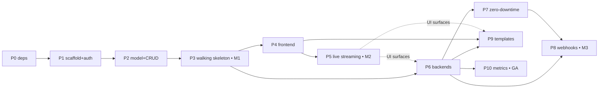

# postlab go — Implementation Roadmap

Execution sequence for the design in [`postlab_go.md`](./postlab_go.md). That document is
the source of truth for *what* `postlab go` is; this one is the source of truth for *in what
order it gets built and how each step is proven done*. When the two disagree on behavior, the
design doc wins; when they disagree on sequencing, this doc wins.

Companion analysis: [`../research/postlab_go_edge_cases.md`](../research/postlab_go_edge_cases.md),
[`../research/postlab_go_alternatives.md`](../research/postlab_go_alternatives.md),
[`../research/postlab_go_diagrams.md`](../research/postlab_go_diagrams.md).

## How to read this

- The original plan's six phases are expanded into **11 phases** with lettered sub-phases.
  A sub-phase is the smallest unit that lands on its own with `make check && make test` green.
- Each phase lists **Depends on**, **Work**, **Exit gate**, and **Risks**. A phase is not
  "done" until its exit gate is met — not when the code merely compiles.
- Phases are ordered so the system is **end-to-end demonstrable as early as possible**
  (walking skeleton at M1), not so that whole layers land at once.

### Shippable milestones

| Milestone | Reached after | What works |
|---|---|---|
| **M1 — Headless deploy** | Phase 3 | `postlab go` serves an authed API; you can create an app and deploy a docker-compose repo end-to-end (git → build → start → health → Caddy) with no browser. |
| **M2 — Usable web UI** | Phase 5 | Dashboard, new-app wizard, env editor, deploy history, and **live** streaming deploy/logs in the browser. |
| **M3 — Multi-runtime + push-to-deploy** | Phase 8 | systemd/static/pm2/k3s backends, zero-downtime swaps, and GitHub/GitLab webhooks. |
| **GA — 1.0** | Phase 10 | Template catalog and Prometheus metrics/sparklines. |
| Post-1.0 | Phase 11 | Tailscale Funnel, WASM plugins, daemon mode. |

### Non-collapsible gates (from CLAUDE.md, apply throughout)

- **QAS** — every sub-phase ends with `make check` (zero warnings) **and** `make test` green.
- **Schema confirmation** — the `apps`/`app_env_vars`/`app_deploys` tables ship as inline
  `CREATE TABLE IF NOT EXISTS` in `db/mod.rs` (Phase 2), **not** files under `migrations/`.
  No `.sql` file is created without user confirmation.
- **Security review** — every system-mutating diff (git, docker, systemd, Caddy, webhook
  receiver, auth) gets a cold-agent security review before merge.
- **Manual web verification** — the web UI can't be verified headlessly, the same way TUI
  screens can't. Any phase touching `web/` ends with an explicit "needs `sudo postlab go` +
  browser check" note; do not claim a UI works without it.
- **CI / `install.sh` confirmation** — `make build-release` frontend integration (Phase 4f)
  and any CD matrix change require user confirmation before touching `.github/workflows/` or
  `install.sh`.
- **`feature_list.json`** — updated whenever a screen, tab, or CLI command is added/renamed
  (Phases 1, 4, and each new page).

---

## Phase 0 — Dependency & repo prep

The cheapest way to de-risk Phase 1: get every dependency and build-gate concern out of the
way first, in one small, reviewable diff that changes no behavior.

**Depends on:** nothing.

**Work**
- [ ] Add to `cli/Cargo.toml` (consume the workspace pins): `axum`, `tower`, `tower-http`,
      `rust-embed`, `dashmap`.
- [ ] `rust-embed`: add the **`debug-embed`** feature (workspace currently pins only
      `compression`) so dev/`check` builds read `web/dist/` from disk and don't require npm.
- [ ] **`dashmap` and `arraydeque` are not in the workspace `Cargo.toml` yet** — add the pins
      there first, then consume. (The design doc's Phase 1 wording assumes they're already
      pinned like axum/tower; they are not.)
- [ ] Add the **`v7`** feature to the workspace `uuid` pin (currently `features = ["v4"]`)
      for `app_deploys.id`.
- [ ] Commit a placeholder `web/dist/index.html` ("run `npm run build`") so `rust-embed`'s
      compile-time `#[folder]` resolution succeeds on a fresh checkout.
- [ ] Fix the two known inconsistencies in `postlab_go.md`: deploy-workflow step 2 references
      `app.deploy_type` (that column is gone — it's now `app.runtime`); and confirm the
      frontend section reads "SvelteKit + adapter-static" throughout.

**Exit gate**
- `make check && make test` green with the new deps present but unused (allow `dead_code`
  where needed, removed as each is consumed).
- Fresh `git clone` + `make build` succeeds **without** running any npm command.

**Risks**
- `debug-embed` + `compression` feature interaction — verify a release build still embeds and
  compresses real assets (re-checked at Phase 4f).

---

## Phase 1 — Server scaffold + auth

Stand up the `postlab go` process: it binds, authenticates, serves the embedded SPA shell,
and exits cleanly. No app logic yet.

**Depends on:** Phase 0.

### 1a — CLI + lifecycle
- [ ] `postlab go` subcommand in `main.rs` with `--port` / `--metrics-port` / `--bind` /
      `--webhook` / `--webhook-port` / `--api-key-file`. (Root check stays — do not weaken.)
- [ ] `AppState { db, platform, app_manager, ws_registry }` skeleton (managers stubbed).
- [ ] Port-bind with **reserved-port-skipping** fallback (API 9020→9023+, webhook 9021→9031+,
      metrics 9022→9041+; never stomp the other two defaults). Explicit `--port` in use →
      hard error, never silent move.
- [ ] Graceful shutdown on SIGINT/SIGTERM (close WS, drain ≤5s, flush WAL, exit 0).
- [ ] Update `feature_list.json` with the `go` command.

### 1b — Auth middleware (day one, not deferred)
- [ ] Bearer token: generated on first run, printed **once** to stdout, stored **hashed** in
      DB. Hash scheme is deterministic — `SHA-256(token)` (edge-case 1.1) — *not* a password
      hash, since the raw token is discarded.
- [ ] Token source precedence: `POSTLAB_API_KEY` env / `--api-key-file` > persisted hash.
      Trim trailing whitespace/newlines from the file (edge-case 2).
- [ ] Origin/Host allow-list middleware (loopback + configured bind). Decide `Origin: null`
      handling explicitly (reject by default).
- [ ] `postlab go --rotate-token` (or equivalent) so a lost token doesn't require DB surgery.

### 1c — Asset serving + transport skeleton
- [ ] `rust-embed` `WebAssets` from `web/dist/`; serve embedded bytes via axum.
- [ ] SPA fallback: all `/ui/*` → `index.html`; API under `/api/v1`.
- [ ] `GET /healthz` (unauthed liveness) + authed `GET /api/v1/ping`.
- [ ] WS endpoint placeholder at `/ws` (upgrade handshake only; no events yet).

**Exit gate**
- `curl http://127.0.0.1:9020/api/v1/ping` → 401 without token, 200 with token.
- Cross-origin / bad-Host request → 403.
- Ctrl+C shuts down within the drain window, exit 0.
- `make check && make test` green.

**Risks**
- Auth middleware ordering (Origin check must run *before* token lookup to avoid a DB hit on
  rebinding attempts).

---

## Phase 2 — Data model + app CRUD + concurrency primitives

**Depends on:** Phase 1.

### 2a — Schema
- [ ] `apps`, `app_env_vars`, `app_deploys` as inline `CREATE TABLE IF NOT EXISTS` in
      `db/mod.rs` (or a `db/apps.rs` helper it calls). **Confirm with user** before touching
      `migrations/` — these do **not** go there.
- [ ] Add a comment in `db/mod.rs` noting `migrations/` are not applied at runtime and inline
      schema must be kept in sync (alternatives doc §2 recommendation).
- [ ] Validate `app.id` / `app_id` as `^[a-z0-9_-]+$` at creation (edge-case 1.10 — load-bearing
      for systemd unit names later).

### 2b — CRUD module + REST
- [ ] `core/apps/` module: create / get / list / delete (cascade) — pure DB, no deploy yet.
- [ ] REST: `GET|POST /api/v1/apps`, `GET|DELETE /api/v1/apps/:id`.
- [ ] Env endpoints: `GET|PUT /api/v1/apps/:id/env`, `DELETE …/env/:key` (mask `secret=1`).
- [ ] Per-app `webhook_secret` generated at create time; surfaced once on read.

### 2c — Concurrency primitives
- [ ] `AppManager` holds `DashMap<app_id, Mutex<()>>` deploy locks (edge-case 1.5); acquire
      before any deploy/rollback/start/stop. Wire the guard now even though deploy lands in P3.

**Exit gate**
- Integration test: create → list → get → put env → delete (cascade verified) over HTTP.
- `make check && make test` green.

**Risks**
- Cascade delete must also remove on-disk `config_dir` and deploy logs, not just rows.

---

## Phase 3 — Walking skeleton: git + docker-compose + deploy pipeline (**M1**)

The keystone phase. One backend, end-to-end, no browser. docker-compose is chosen first
because it's the only backend with partial existing code and it sidesteps the toolchain
question (the image carries the build).

**Depends on:** Phase 2.

### 3a — Net-new `--ff-only` git layer
- [ ] Replace the bare-`git pull` stub (`core/deploy/git.rs`): `git clone` when absent, else
      `git pull --ff-only`. Run `git status --porcelain` first; refuse dirty trees with a
      clear error (edge-case 3). Provide a force-redeploy path that discards local changes.

### 3b — RuntimeBackend trait + dispatch
- [ ] Define the trait per design doc, including **`supports_http_health()`** opt-out.
- [ ] `AppManager` dispatch on `app.runtime` (single backend registered for now).

### 3c — docker-compose backend
- [ ] Generate `docker-compose.yml` (+ minimal `Dockerfile` when the repo lacks one) with port
      mapping and env file. start/stop/status/logs via `docker compose …`.

### 3d — Deploy workflow engine
- [ ] `AppManager::deploy`: git → detect (compose only for now) → build → generate config →
      start → health → gateway → complete. Writes `app_deploys` rows and a log file at
      `~/postlab/apps/<id>/deploys/<deploy_id>.log`.
- [ ] `POST /api/v1/apps/:id/deploy`, `…/stop`, `…/start`.

### 3e — Health checker
- [ ] Poll `GET :port{health_path}` every 500ms; **configurable** timeout, default 30s
      (edge-case 3 — JVM/large images). On failure: mark deploy failed, leave old version up.

### 3f — Gateway integration
- [ ] When `app.domain` set, call existing `CaddyManager::add_route` → `localhost:{port}`;
      reload. (CaddyManager is real today — wire, don't build.)

**Exit gate (M1)**
- From a clean DB: `POST /apps` then `POST /apps/:id/deploy` against a real public
  docker-compose repo brings the app to `running`, with a domain reachable through Caddy and
  a deploy log on disk. Demonstrated headless (curl only).
- `make check && make test` green. Security review of the deploy/git/gateway diff.

**Risks**
- Build output streaming isn't here yet (lands P5); deploy is synchronous/log-file-only for now.
- Caddy auto-TLS needs a real domain — document a localhost/`:port` smoke path for CI.

---

## Phase 4 — Frontend MVP (**toward M2**)

**Depends on:** Phase 3 (a real API to talk to).

### 4a — Scaffold
- [ ] `web/` SvelteKit project, `adapter-static` SPA (`fallback: index.html`, prerender off).
- [ ] `lib/api.ts` (typed fetch wrappers), `lib/ws.ts` (client w/ reconnect, stubbed until P5),
      `lib/stores.ts`.

### 4b — Login + token handling
- [ ] Login screen: token entered, held **in memory only** (document re-entry on reload).

### 4c–4e — Pages
- [ ] Dashboard: app list + system overview gauges (from Platform).
- [ ] New-app wizard (runtime → source → domain → env → review).
- [ ] App detail overview (status, domain, latest deploy), env editor (masking), deploy history.
- [ ] Update `feature_list.json` with each web page.

### 4f — Build integration
- [ ] `make build-release` runs `npm ci && npm run build` → `web/dist/`, then cargo. `make
      build`/`make check` stay npm-free (debug-embed). **Confirm before editing CI** if the CD
      matrix needs the node toolchain.

**Exit gate**
- `sudo postlab go` + browser: create an app via the wizard and watch it deploy (poll-based
  until P5). **Manual verification required — cannot be headless.**
- `make check && make test` green.

**Risks**
- SPA base-path / API-URL handling under the embedded server (alternatives §4 caveat).
- Release embed path (4f) is the first time real assets compile in — re-verify Phase 0's
  debug-embed/compression interaction.

---

## Phase 5 — Live streaming (**M2**)

**Depends on:** Phase 4.

- [ ] `WsRegistry` (`DashMap<app_id, Vec<Sender>>`); real `/ws` event broadcast.
- [ ] Deploy workflow emits `deploy.progress` line-by-line. **Split on `\r` as well as `\n`**
      so `npm ci`-style carriage-return progress streams correctly (edge-case 3).
- [ ] Streaming deploy log in wizard + detail page.
- [ ] `app.status` events; live per-app log viewer (`docker compose logs -f` equivalent).

**Exit gate (M2)**
- Browser shows a deploy streaming in real time and live app logs. Manual verification.
- `make check && make test` green.

**Risks**
- Backpressure / slow consumers on the WS registry; cap buffered lines per client.

---

## Phase 6 — Remaining runtime backends

Each sub-phase is independently shippable and ends by deploying a representative repo. Ordered
easiest-first.

**Depends on:** Phase 3 (trait + dispatch).

- [ ] **6a — static**: Caddy config → repo dir, no process, `supports_http_health() = false`;
      UI must not show a failing health badge (edge-case 4).
- [ ] **6b — systemd**: generate `.service`, install to `/etc/systemd/system/<app_id>.service`,
      `systemctl` start/stop, `journalctl` logs. **Resolve the build story** for go/rust
      (where/whether the binary compiles, toolchain-present check) — the most underspecified
      part of the design. Relies on Phase 2a `app_id` validation.
- [ ] **6c — detector rewrite**: Node / Python / Go / Rust / static (replaces the 2-case stub).
      Define precedence when multiple markers match (e.g. `Dockerfile` + `package.json`) or
      prompt in the wizard (edge-case 3).
- [ ] **6d — pm2**: `ecosystem.config.js`; install only with **explicit consent** (root-install
      caveat, edge-case 4).
- [ ] **6e — k3s**: generate deployment/service/ingress, `kubectl apply`; **detect prereqs and
      fail gracefully** if kubectl/cluster absent (edge-case 4).
- [ ] **6f — wasmcloud**: wrap the existing `runner.rs` path into the trait rather than leaving
      a parallel code path (edge-case 4).

**Exit gate (per sub-phase)**
- A representative repo deploys, runs, logs, and tears down via that backend.
- Security review for systemd/pm2/k3s diffs (they write privileged units/manifests).
- `make check && make test` green.

---

## Phase 7 — Zero-downtime deploys

**Depends on:** Phase 6 (docker-compose from P3; k3s from 6e).

- [ ] Temp-port + Caddy route-swap for **docker-compose and k3s only** (systemd/pm2 = restart,
      static = git pull, per alternatives §8).
- [ ] **Probe temp-port bind availability** before selecting it (edge-case 1.8).
- [ ] **Orphan cleanup**: if health passes but gateway update fails, stop the new
      container/pod and keep the old route (edge-case 1.9).
- [ ] Rollback flow: checkout previous successful commit, re-run from build step (not git-revert).

**Exit gate**
- A redeploy swaps with no dropped requests against a continuously-curled endpoint; an induced
  gateway failure leaves no orphan container and the old version still serving.
- `make check && make test` green. Security review.

---

## Phase 8 — Webhooks / push-to-deploy (**M3**)

Intentionally **after** backends and zero-downtime: a webhook is only meaningful once a real
deploy across runtimes works, and it exposes a root-privileged trigger to the internet, so it
gets the most scrutiny.

**Depends on:** Phase 6, Phase 7 (rollback).

- [ ] **8a** — opt-in receiver, separate axum server on `0.0.0.0:9021`, off unless `--webhook`.
- [ ] **8b** — GitHub handler: candidate set by repo URL, then validate HMAC against **every**
      candidate's own secret (repo URL never authorizes — edge-case 1.3). Per-app secret only,
      **no shared fallback**.
- [ ] **8c** — GitLab handler (token/secret header equivalent).
- [ ] **8d** — **persisted** replay/dedup: store delivery IDs in SQLite with a TTL (~24h),
      reject duplicates **across restarts**, and reject out-of-skew timestamps (edge-case 1.2).
- [ ] **8e** — `POST /api/v1/apps/:id/rollback` surfaced in API/UI.
- [ ] Each receiver request → 202 immediately, `tokio::spawn` deploy, WS events to UI.

**Exit gate (M3)**
- A real GitHub push triggers a deploy; a replayed delivery (same ID) is rejected after a
  server restart; a forged payload with a real repo URL but wrong HMAC is rejected 401.
- Security review (mandatory — internet-facing root trigger).
- `make check && make test` green.

---

## Phase 9 — Template catalog

**Depends on:** Phase 6 (docker-compose), Phase 4 (UI).

- [ ] `cli/src/web/templates.json` embedded at compile time.
- [ ] `GET /api/v1/templates`, `POST /api/v1/templates/:id/deploy` (`{domain}` substitution).
- [ ] Templates page; deploy flow = wizard with locked, pre-filled fields.
- [ ] Initial set: n8n, Uptime Kuma, NocoDB, Ghost, MinIO, Plausible, Nextcloud, WordPress.

**Exit gate**
- Deploy n8n from the catalog supplying only name + domain; reaches `running`. Manual UI check.
- `make check && make test` green.

---

## Phase 10 — Metrics & observability (**GA / 1.0**)

**Depends on:** Phase 6.

- [ ] Per-app in-memory ring buffer (`DashMap<app_id, ArrayDeque<MetricSample, 720>>`); 5s
      sampler task. **Not persisted** to SQLite (write-amplification / 1s-PK collision —
      alternatives §6).
- [ ] `GET /metrics` Prometheus text on `127.0.0.1:9022` (no auth → keep loopback-only; document
      firewall note, edge-case 2). App-level + system-level series.
- [ ] UI sparklines (`MetricsSpark.svelte`) reading the buffer; document that restart resets them.

**Exit gate (GA)**
- `curl 127.0.0.1:9022/metrics` returns valid Prometheus text; UI sparklines update live.
- `make check && make test` green.

---

## Phase 11 — Post-1.0 / future (not scheduled)

Tracked, not committed. Each is its own design effort.

- `postlab go --funnel` — Tailscale Funnel for secure remote access.
- WASM plugins — third-party pages calling the REST API.
- `postlab go --daemon` — daemonize (systemd/PID/journald) so TUI and web can run together;
  if pursued, keep the `AppState` shape so the inline→daemon extraction is mechanical
  (alternatives §1 recommendation).

---

## Dependency graph

P4 (frontend) and P6 (backends) can proceed in parallel after P3 — they only converge where
the UI surfaces a backend's runtime (the dotted edges). That parallel split is the main
opportunity to fan out work.
