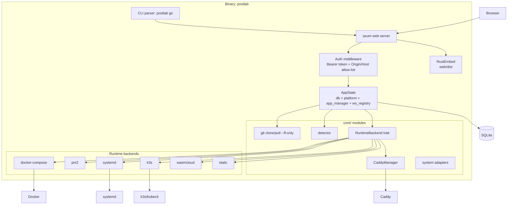
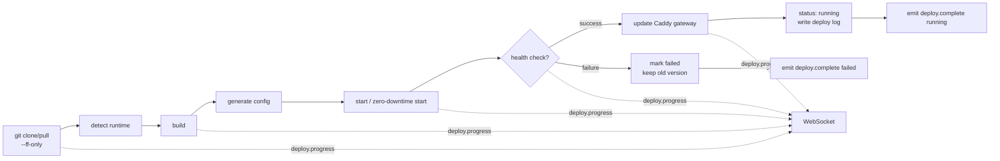
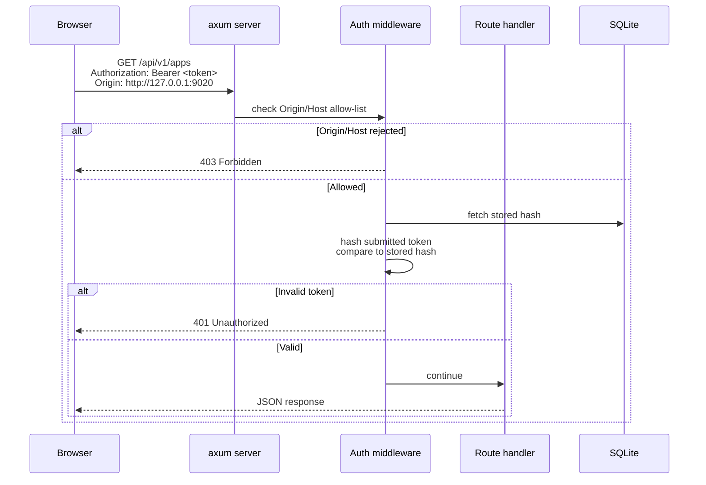
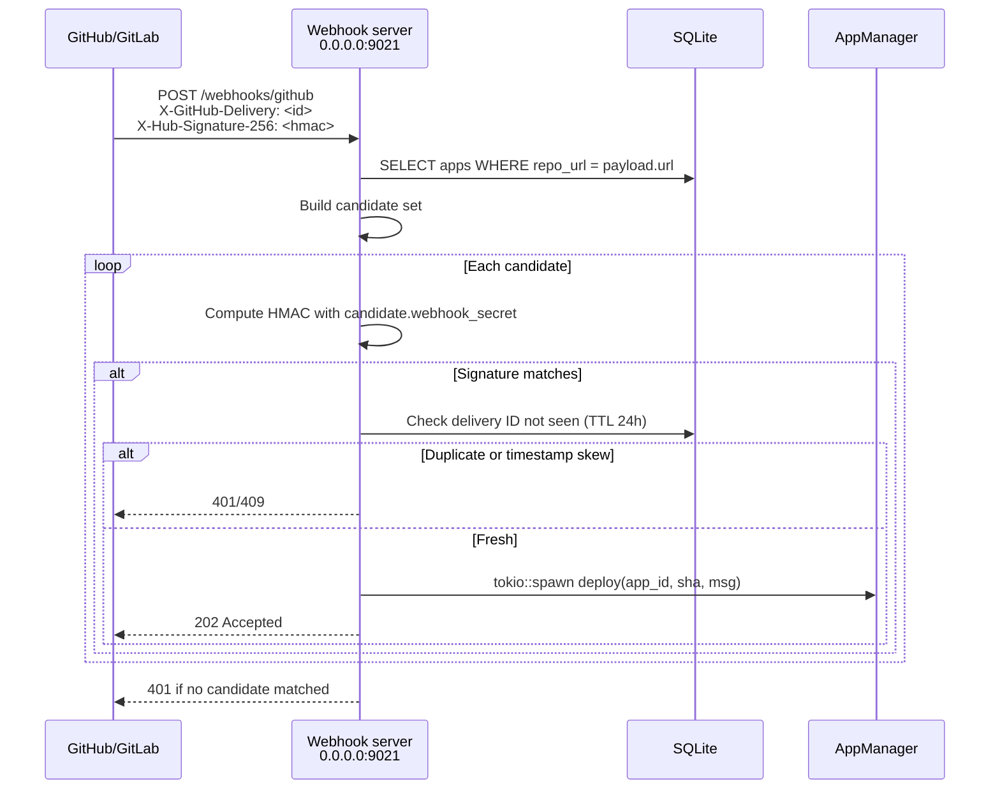
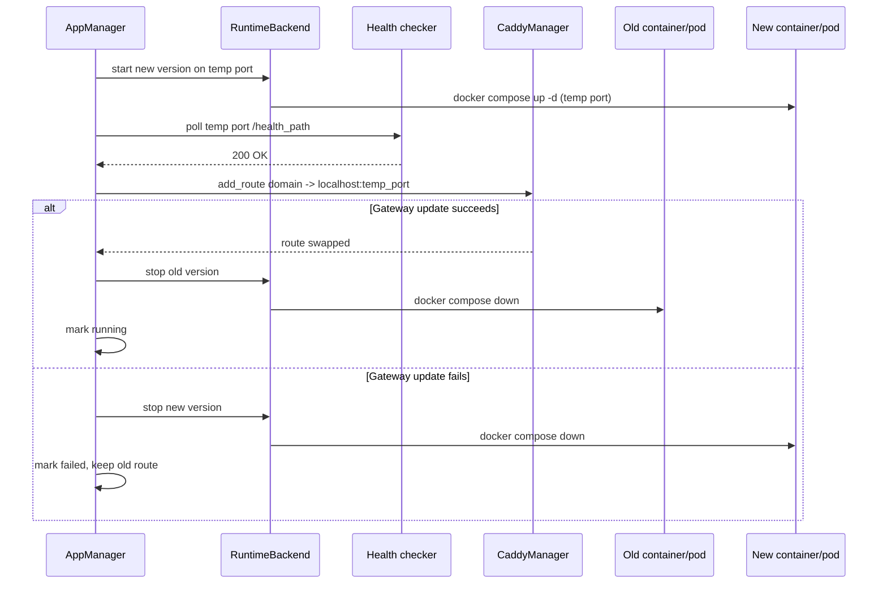
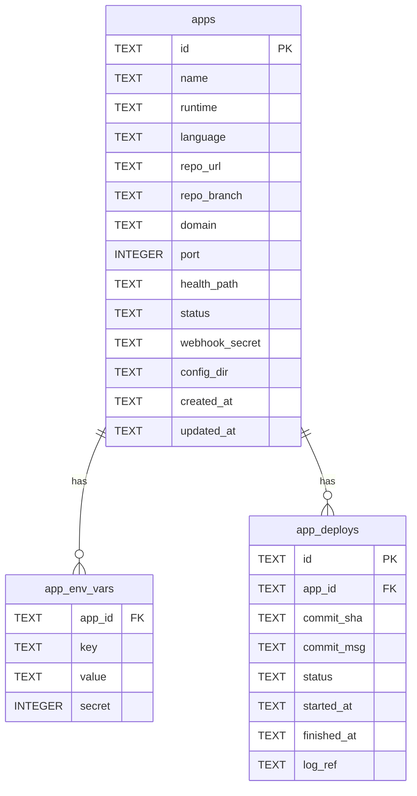
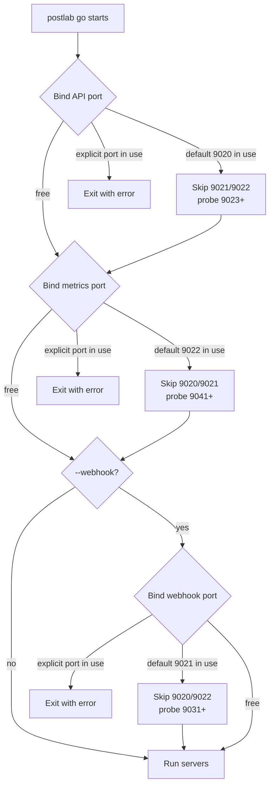

# postlab go — Architecture and Flow Diagrams

Source: `docs/plan/postlab_go.md`

## 1. Overall architecture

## 2. Deploy workflow

## 3. API authentication flow

## 4. Webhook receiver flow

## 5. Zero-downtime deploy sequence (docker-compose / k3s)

## 6. Data model

## 7. Port allocation fallback

